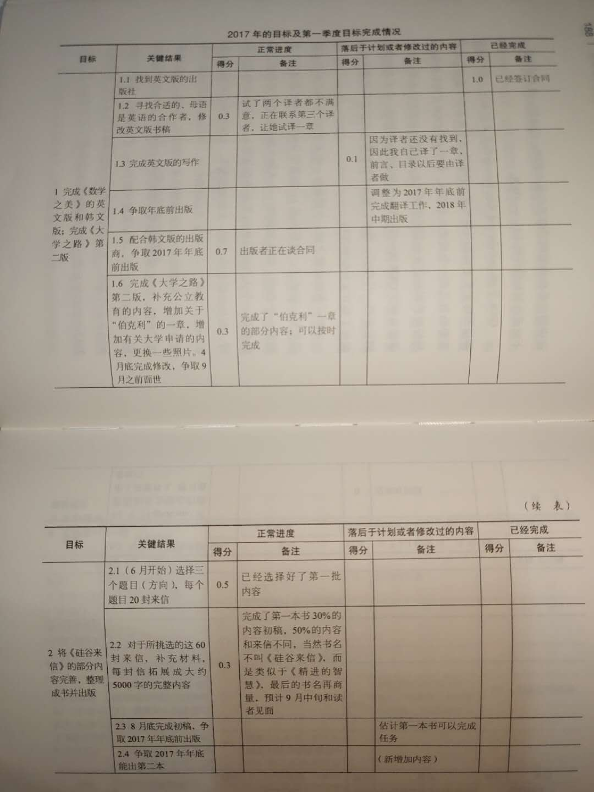
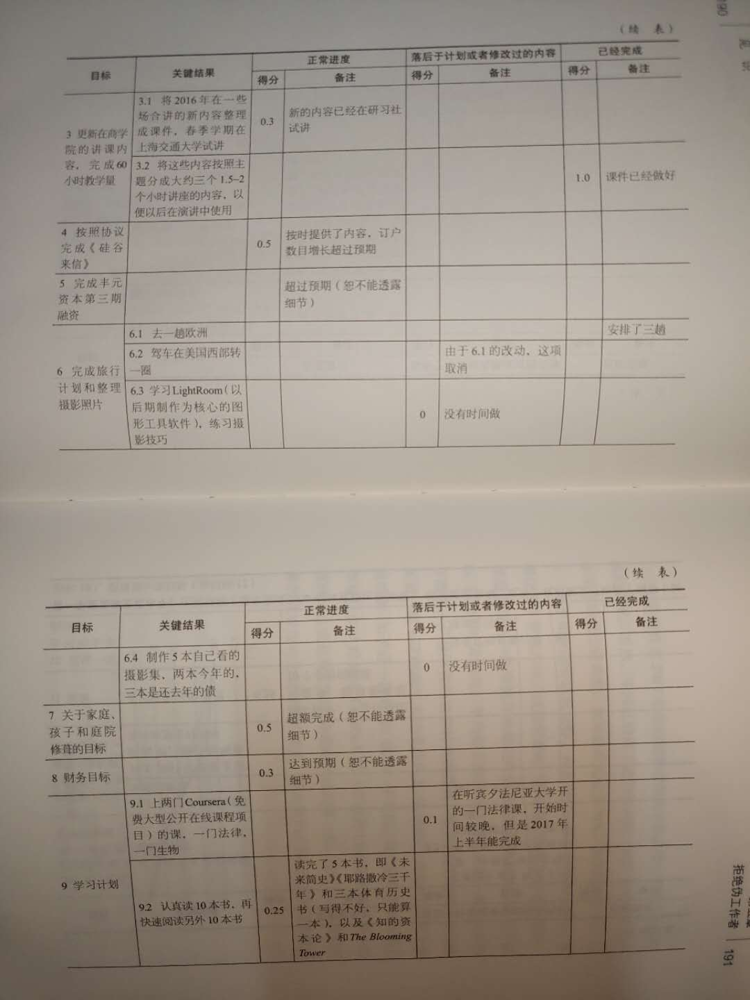
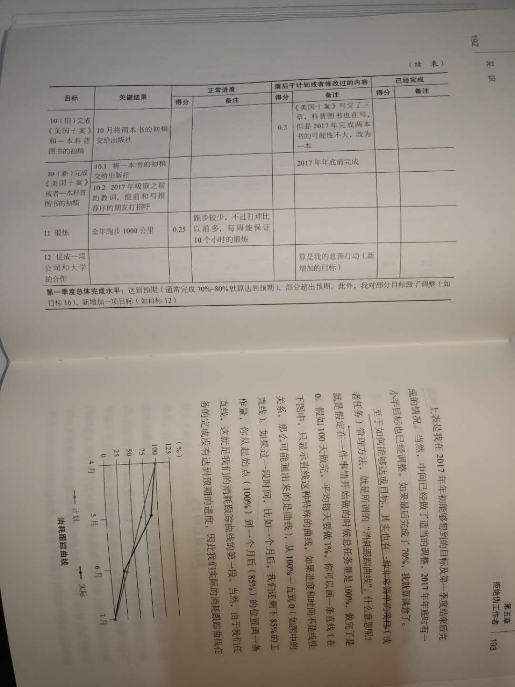
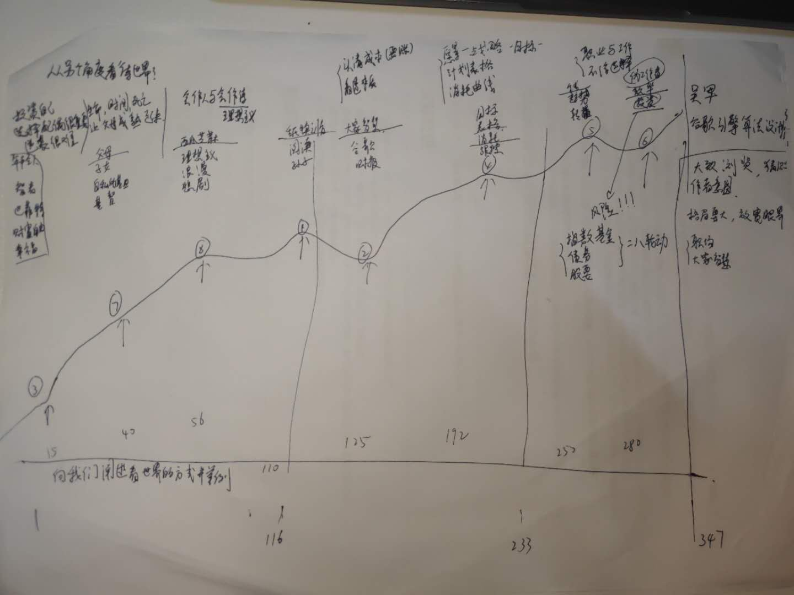

《见识》这本书是从我关注的一个微信公众号博主的一篇文章，推送里面得知的。后来去了解了一下得知这本书是吴军老师写的。索性便直接买回来看看。这篇文章就总结下，读了这本书之后所收获到的几点。

从整体上来说，这本书阐述了吴军老师对人生，对职业，对投资的几点思考和建议。

<!--more-->

## 一、关于人生

从这个角度来说，我非常喜欢这本书的第一章的标题，叫做**幸福是目的，成功是手段。**这章里面吴军老师说，一个人需要相信自己的命运。而关于命，每个人是有不同的理解。

> 作者对它的定义是，命运取决于两个因素，一个是环境因素，是由我们的出身和环境来决定的。而另一个是我们自己对未来走向的规划，这一点是我们自己努力博弈出来的。所谓的命，我们能掌握的就是一个人看问题和做事情的方法，仅此而已，但是他们决定了一个人的一生。

一个人的出生确实会对他人生产生非常大的，包括他所处的环境，他父母所能给他的教育。这些都会对他整个人生的命运产生非常大的影响。而另外一点就是我们常说的是，人的命运是掌握在自己的手里。这些先天出生环境我们不能决定。但是我们可以规划自己的未来方向，通过自己的努力获得自己想要的人生。当然，对于一个普通人来说，想要逆袭真的是非常难，非常难的一件事情。作者在书中举了个例子，你可能需要花半辈子时间，来弥补自己的不足。然后再花半辈子的时间来追赶别人。因为别人的先天条件比你好的话，那么可能他只要付出三分的努力，就可以达到你付出十分努力所带来的效果。因此你必须要花很长的时间来弥补自己的不足，然后再努力的去追赶人家的脚步。

### 1.对男生女生的建议

人生最重要的投资其实是投资自己。对男生来说，选择好一个配偶十分重要。一个女生，她所表现出来的气质涵养，实际上跟她的家庭有很大的关系。选择一个聪明的跟你价值观完全相符合的女生，这对于你自己人生的未来会有很大的裨益，也对你们的下一代有很大的好处。同时，男生需要有足够的独立性，承担自己未来对家庭的义务。在一段婚姻中，双方都需要明白关系的亲密程度和重要性依次是，**“夫妻优先于子女，更优先于双方的父母。”**

有很多人觉得结婚其实是两个家庭的事情。包括我以前对婚姻的看法，也应该是这样的。然而在这本书里面，吴军老师说，婚姻它并不一定是两个家庭的事情，而是两个人要分得清楚大家和小家，婚姻组成的家庭是两个人的小家，而各自的父母是大家。两个人在婚姻中需要分清大家和小家之间的边界。

> 一个人，特别是年轻的时候，可塑性非常重要。两个人在一起时间一长，肯定会遇到矛盾，能够有一些柔韧，彼此妥协的解决问题，相互适应，才能更好、更长远的走下去。

对于女生来说，需要分清楚婚姻与恋爱的不同。恋爱是激情，是化学物质分泌所带来的愉悦；而婚姻则是两个人共同构造一个舒适体。在这个舒适体中，双方都会受益，彼此成长。不要总觉得老实的男人才能靠的住这种事情，或者找一个自己可以控制的了的人。因为你其实会发现很多身边看似老实的男人，会做出一些让你们大跌眼镜的事情。其实这些东西它本质上并没有什么意外的。因为人性就摆在那里。女生应该靠自己的能力去辨别一个，对自己好的男生。而对自己好，不应该靠男生怎么说来评判，要去发现他是怎么做。需要判断这个人的价值观和爱情观是否与自己相符，是否认可夫妻间的关系的重要性高于其他关系的重要性。其实，你只要仔细观察就可以发现他对你们之间关系的在乎程度。

> 当然，一个男生最终能否对你好，还要看他有没有这个能力。因为大部分男生都会描绘一个美好的未来，但是很多人根本无力去实现它。

### 2.做人和作诗

最近我在办公室中，跟一些同事玩得越来越熟。有些同事会说我是一个很会说话的人。然而当我听到他们是这样评价我的时候，其实我的内心对自己是有很多失望。因为我知道我并不是个情商很高，很会说话的人。我只是会偶尔抖个机灵，然后不吝啬我的赞美。可能这些东西在别人的眼中，会有一点拍马屁的倾向。在这本书里面，吴军老师把这些东西称之为会做人。在这个社会中并不缺会做人的人，但是缺会做诗的人。

这里的作诗指的是，他们有一种理想主义式的叛逆精神。在我的理解里，这是一种纯粹的理想主义。有一些了解我的朋友，可能因为觉得我喜欢老罗，而认为我是个很理想主义的人。但是我其实更倾向于把自己归结为是一个现实理想主义者。我非常的认可和赞美理想主义式的行为。不过就我本身而言，其实我在很多时候是做不到完全的理想主义。因为我觉得脱离了现实的理想主义行为，是一种非常不理智的，甚至会给自己和家人带来生活上的窘境的行为。当然我也不喜欢那些把自己利益看得很重的精致利己主义者。我喜欢的是像鲁迅那样，一边拿着国民政府的钱，一边去骂国民政府。大概我的信条是应该在很多事情上有着理想主义的原则，但是不能脱离现实而活着。守住自己的底线，照顾好自己的家人，而不是用一种很幼稚的理想主义行为去跟这个丑恶世界进行搏斗。

### 3.非线性增长

在这本书的第四章叫做大家智慧。作者写了一些名人的故事，他告诉我们，**做事情要认清成本并且看透本质。**关于看透本质这件事情，我有另外个理解，叫做非线性增长。这是我从投资中学来的，不管是人生还是投资，在很多的时候都不是一个线性增长的过程。它是一个缓慢的由量变累积产生质变的一个非线性增长过程。它需要前期不断的进行投入累积，达到了临界点之后，发生一个突变带来很多的回报。所以我们需要看透这个增长过程的本质是非线性的，并不是投入多少就会得到多少回报。而是需要找到那个临界点，不断的积累，之后就会产生质变获得很大的提升。

就拿工作这件事情来说，工资的增长并不是线性的，他是一个人内在价值的外在定价。所以说，作者给毕业生的建议是，在工作的前三年不要太去关注工资是多少，而需要关注的是自己内在价值的提升。你自己的内在价值才是工资的本质。等到在前几年工作上有了很好的工作经验的累积，技能的提升，内在价值的积累产生质变就会体现在你的工资的大幅增长上。这一点跟延迟满足感也是同样的道理。就是说我们需要放弃前期短暂的满足感，而不断的积累，坚持到后来产生更大的收益。

### 3.做好最后的1%

在做事情的时候，需要做好最后的1%。因为其实很多人之间的能力差距可能并没有那么大，但是正是这1%却会拉开很大的差距。这一点是我需要始终铭记的，我在很多方面的最后1%做的都不够好。

## 二、关于职业

### 1. 职业误区

在职业方面，吴军老师给我最多的启发是：**不要走入一个工作和职业分不清的误区。**

工作是谋生的手段，你去单位上班然后单位给了你一分工资就两清了。然而职业，却是需要从事一辈子的事情。为了这个一辈子的发展，应该选择性的做一些对职业有利的事情，不论是否有报酬或者报酬的高低。

对待自己的职业需要专业的工作态度，所谓的专业，就是一切以工作目标达成为中心，所有的会议、沟通都是以此为核心。不管在任何情况下，能够把事情做好才能够体现出你的职业素质。成为一个专业人士，也是我入职以后，邹总在给我们的新人培训中所提出的一点希望。希望我们能够专业人士的态度，把属于自己的每件事情做好，而不去考虑当前的一些短暂利益。

另外一个启发是：**不要把自己当成一个单位的过客，而是将自己当成主人。**对比我之前在恒生的体验来说，我其实从一开始入职恒生的时候，就想把恒生作为一个不错的跳板。其实这样子对我来说是很不利的。在整个工作过程中，我并没有去做一个专业人士应该做的事情。所以我希望在以后我所经历的每一家公司，都有一种主人翁的意识。不仅仅需要把这当成是一份工作，而是当成我的职业来做。成为一个专业的人士，对我来说很重要。

为了避免陷入这些误区，吴军老师给我们提出了几个解决办法。

- 第一，任何时候都要为人谦卑，只有谦卑才能更有效的沟通。
- 第二，要用正确的方法对待语言暴力和其他故意伤害。
- 第三，永远要明确工作不是为了公司或者他人，而是为了自己的职业发展这个既定的大方向。想要成为领导者，要平实的学习做一个领导。走出自己的一亩三分地，主动的多做事情，多跟人打交道，去帮助他人，支持自己的老板和团队。
- 第四，注重长期效益，把一件事情放到2到3年的时间周期来看，这时候我们对它的态度就会完全的不同。永远在一家公司不要有过客心态，要抱着学本事的心态去专心的干事情。
- 第五，作为一个基层员工，需要有大局观。你不仅需要看到你工作中所专注的一些细节，你需要看到整个项目，整个团队是如何运行的。

### 2. 伪工作者

作为一个程序员，我自然的想要在工作的时候追求效率减少加班。在这本书中，吴军老师提出了我们要拒绝做一个伪工作者。

- 我们首先需要确定，**愿景-目标-道路。**愿景就是说我们要确定一个明确的方向，然后在这个明确的方向上，我们需要设置一些阶段性的目标，战略的核心就是达到这些既定的目标，进而实现我们的愿景。
- 第二点是，即使听到了不中听的话也一定要虚心找出其中的合理之处。每次遇到别人和自己意见相左时，一定要开启寻找对方合理性的开关，这样会对你自己有很大的提升。
- 第三点时，凡事要做记录。做记录的过程其实是，有思考了一遍，这样会使得你进步更快。

同时作者还分享了自己谷歌目标工作管理方法。将自己的年度目标，列成一个表格。然后再制作一个消耗跟踪曲线来跟踪自己的目标完成情况。

## 三、关于投资 

### 1.金钱观

这本书的最后一部分作者关于投资的一些看法。每个人都需要有一个正确的金钱观和理性的投资观。首先是金钱观，在现实生活中，必须要有那种没有钱是万万不能的思想。如果太过理想的去抛弃了很多东西的话，只会让你的生活变得很糟糕，并且没有能力照顾你的家人。鲁迅先生自己曾讲，饭碗可以跟理想分开。我们每个人都需要，在这个现实的世界中很好的生活下去，所以你需要努力的保住你的饭碗。这一点是非常重要的。

另外一点是：钱只有花出去了，才是你的。在很多时候，我们不应该吝啬自己。就我本人来说，凡是我觉得会提高自己的生活品质的东西就肯定会买。但是我会根据自己的收入，来分配投资和消费的比例。因为有些东西，它并不是很紧急的。比如我最近一直想买的键盘和音箱。因为我本身比较喜欢这些电子产品，但是我这个月已经买了手机，而这些东西又不是非常紧急。所以，我可以把剩下的钱部分用作生活费，另一部分用作投资理财。等下个月的工资发下来之后，再去买键盘和音响。

### 2.投资观

再来说说投资观。因为我的工作跟金融有关，同时我也很爱钱。所以就很自然的，对投资理财感兴趣。之前我读过一本书，它说你在投资的时候，首先需要确定的一点就是，**风险意识。**我一开始并不知道怎么看待这个风险。但是关注了这个行业一段时间之后，就发现那些很著名的理财投资人，他们都会给自己和自己的家庭买上各种各样的保险。其实保险它的本质上就是转移你的生活风险大家都知道，在现实生活中，一场疾病很可能会把一个家庭给他。但是如果我们提前配置了保险的话可能情况就会好很多，而这也是风险意识的一种体现。

其实不仅是理财，在生活中的任何事情都有风险，如果我们提前有了风险意识，并且对可能发生的这些风险的情况，作出应对策略的话，那么我们就可以很好的应对生活中的那些未知情况。

这本书里面关于投资的一些思想，其实跟我以前对于投资的认识，是很相似的，我非常赞同吴军老师在这本书里面所提出的投资观点。比如专业人士并不一定会比我们的自己投资做的好。

对于投资来说，最好的投资品种还是权益类投资。这里的权益类投资指的是债券、股票、指数基金等。从历史数据来看，不论是哪个国家，投资股市都是回报率最高的一种方式。而单个股票的投资风险是很高的，因为它存在于价值归零的可能。但是如果你投资指数基金的话，情况就完全不一样，你只要在指数低估的区间买入，然后长期持有或者定期投入的话，就可以获得一个相对不错的收益。所以对于普通的上班族来说，努力工作扩大每月的现金流。然后将每月的闲钱去投资到指数基金中，会给我们带来相对不错的受益。同时我们需要有足够的风险意识，给自己配置上保险来应对可能发生的亏损情况。

